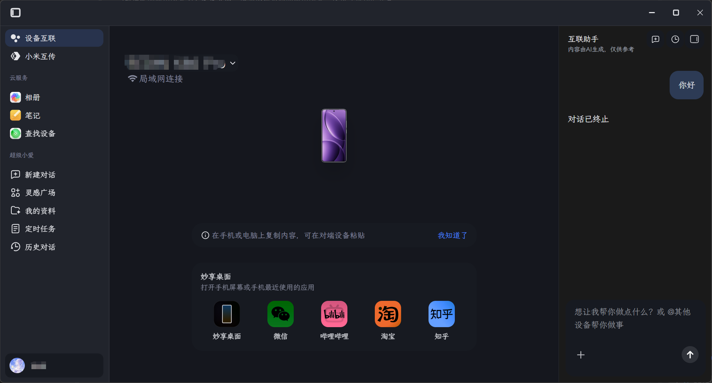
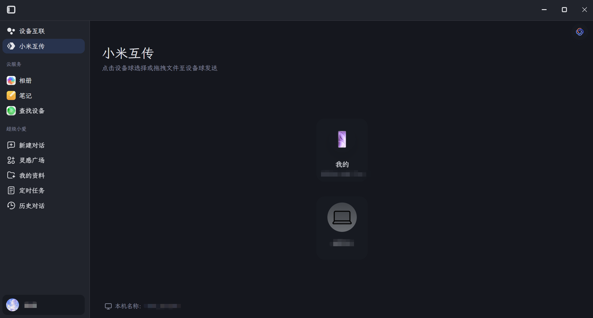
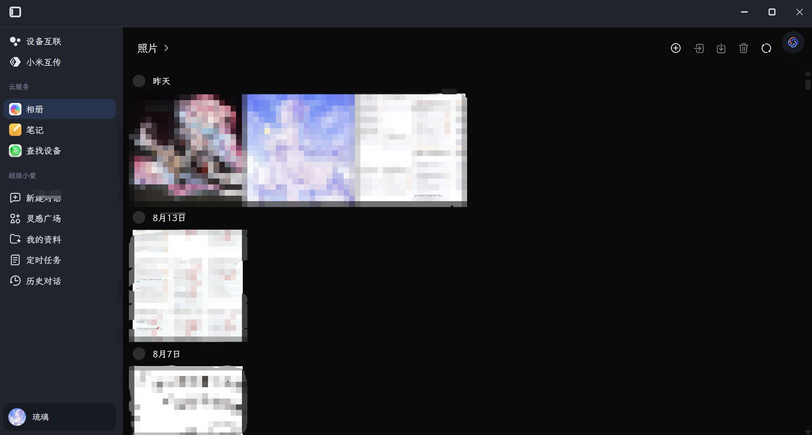
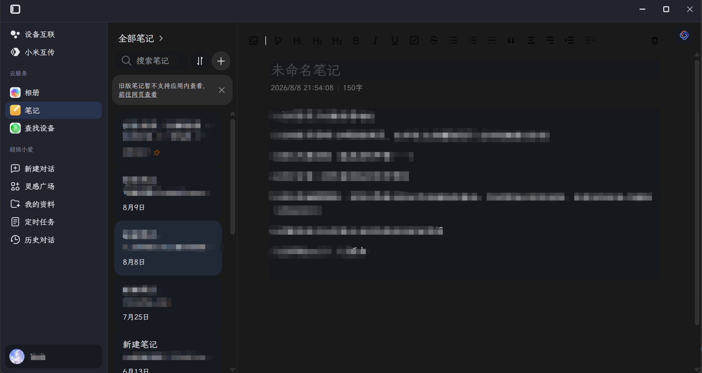
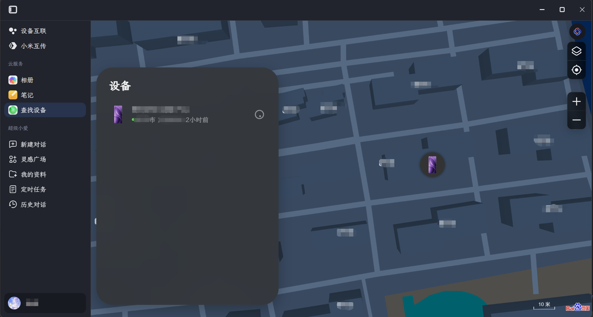
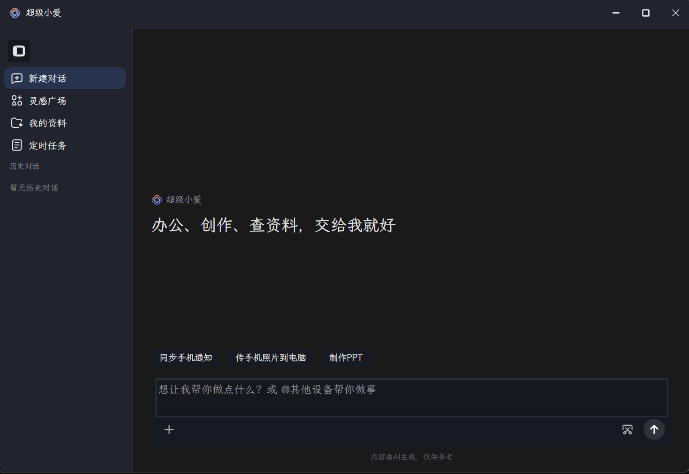
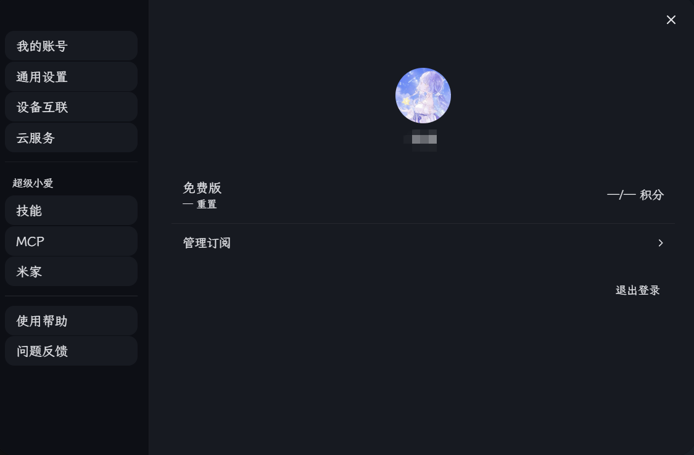
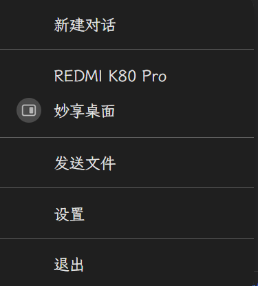

# 小米互聯服務 - 深色模式支援

這是一個為 PC 版「小米互聯服務」提供深色模式支援的專案，同時也支援跟隨 Windows 系統註冊表字型設定。

> 目前適配的應用版本為 2.0.0.429。請勿嘗試替換至不同的應用版本，否則將導致功能異常。

## 啟用方法

1. 下載專案中的檔案 [app.asar](app.asar)
2. 將其替換到：`C:\Program Files\MI\HyperConnect\2.0.0.429\resources\app.asar`（Windows）

## 說明

- 此專案包含完整的熱切換深色模式適配支援，能夠偵測系統目前主題設定並自動跟隨。
- 要切換應用的主題狀態，請前往：設定 - 個人化 - 色彩 - 選擇模式（Windows）
- 對於 Windows 使用者，如需根據日落時間或自訂時間自動切換系統主題，建議使用：
  - [Microsoft PowerToys Light Switch](https://apps.microsoft.com/detail/XP89DCGQ3K6VLD)
  - [Auto Dark Mode](https://apps.microsoft.com/detail/XP8JK4HZBVF435)
- 對於 Windows 使用者，如需修改您的註冊表以實現全域系統字型修改（高風險操作），建議使用：
  - [noMeiryoUI](https://github.com/Tatsu-syo/noMeiryoUI/releases)

## 效果預覽

|  |  |  |  |
| --- | --- | --- | --- |
|  |  |  |  |
|  |  |  |  |
